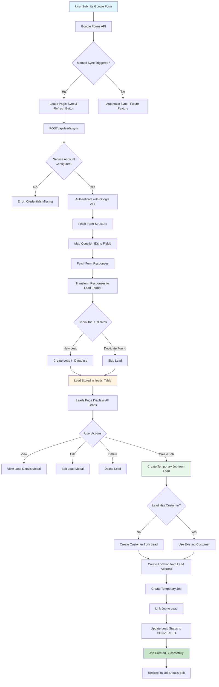

# Google Forms Integration Flowchart

This document describes the complete flow of the Google Forms integration system, from form submission to job creation.

## System Overview

```
┌─────────────────────────────────────────────────────────────────┐
│                    GOOGLE FORMS INTEGRATION FLOW                 │
└─────────────────────────────────────────────────────────────────┘
```

## Flow Diagram



## Detailed Process Steps

### 1. Configuration Phase (Settings Page)

```
Settings → Google Forms Tab
├── Add/Edit Google Form URLs
├── Configure Form Name, URL, Description
├── Set Active/Inactive Status
└── Store in 'google_forms' table
```

**Key Components:**
- `pages/dashboard/settings.js` - Settings UI
- `google_forms` table - Stores form configurations
- Environment Variables:
  - `GOOGLE_SERVICE_ACCOUNT_EMAIL`
  - `GOOGLE_PRIVATE_KEY`

### 2. Sync Phase (Leads Page)

```
Leads Page → Sync & Refresh Button
├── Select Google Form (if multiple)
├── POST /api/leads/sync
│   ├── Authenticate with Google Service Account
│   ├── Fetch Form Structure (map questions)
│   ├── Fetch Form Responses
│   ├── Transform to Lead Format
│   ├── Check Duplicates (by response_id or email+timestamp)
│   └── Bulk Create New Leads
└── Display Results (Created/Skipped counts)
```

**Key Files:**
- `pages/customer-leads/index.js` - Leads page UI
- `pages/api/leads/sync.js` - Sync API endpoint
- `lib/supabase/database.js` - Lead service operations

### 3. Lead Management Phase

```
Leads Table Display
├── Filter by Status (All, Pending Services)
├── View Lead Details
├── Edit Lead Information
├── Delete Lead
└── Create Job from Lead (NEW FEATURE)
```

**Lead Statuses:**
- `PENDING` - New lead, not yet contacted
- `CONTACTED` - Lead has been contacted
- `CONVERTED` - Lead converted to customer/job
- `REJECTED` - Lead rejected
- `COMPLETED` - Service completed

### 4. Job Creation Phase (Proposed Feature)

```
Create Job from Lead
├── Validate Lead Data
│   ├── Check required fields (email, name, address)
│   ├── Check service dates
│   └── Check time slot
├── Create/Find Customer
│   ├── Search by email
│   ├── If exists: Use existing customer
│   └── If not: Create new customer from lead
├── Create/Find Location
│   ├── Use lead address (block, unit, full address)
│   ├── Check if location exists for customer
│   └── If not: Create new location
├── Create Temporary Job
│   ├── Use first_service_date as scheduled_start
│   ├── Extract time from time_slot
│   ├── Set job title from lead notes or default
│   ├── Set priority (default: MEDIUM)
│   └── Set status (default: PENDING)
├── Link Job to Lead
│   ├── Update lead.customer_id
│   ├── Update lead.status = 'CONVERTED'
│   └── Store job_id reference (if needed)
└── Redirect to Job Edit Page
```

## Data Flow

### Lead Data Structure

```javascript
{
  id: UUID,
  google_form_response_id: String (unique),
  email: String (required),
  full_name: String (required),
  salutation: String,
  handphone: String,
  block: String,
  unit: String,
  address: Text,
  first_service_date: Date,
  second_service_date: Date,
  third_service_date: Date,
  fourth_service_date: Date,
  time_slot: String,
  agreed_to_terms: Boolean,
  personal_info_consent: Boolean,
  status: 'PENDING' | 'CONTACTED' | 'CONVERTED' | 'REJECTED' | 'COMPLETED',
  source: 'GOOGLE_FORM',
  notes: Text,
  customer_id: UUID (nullable),
  converted_at: Timestamp,
  submitted_at: Timestamp
}
```

### Job Data Structure (from Lead)

```javascript
{
  customer_id: UUID (from lead or created),
  location_id: UUID (from lead address or created),
  job_number: String (auto-generated),
  title: String (from lead or default),
  description: Text (from lead notes),
  priority: 'LOW' | 'MEDIUM' | 'HIGH' | 'URGENT',
  status: 'PENDING' | 'IN_PROGRESS' | 'UPCOMING' | 'COMPLETED',
  scheduled_start: Timestamp (from first_service_date + time_slot),
  scheduled_end: Timestamp (calculated),
  // Link to lead (via service_call or notes)
}
```

## API Endpoints

### 1. Sync Leads
```
POST /api/leads/sync
Body: { form_id?: string }
Response: {
  success: boolean,
  created: number,
  skipped: number,
  total: number
}
```

### 2. Get Leads
```
GET /api/leads?status=PENDING&source=GOOGLE_FORM
Response: {
  leads: Lead[],
  total: number
}
```

### 3. Update Lead
```
PUT /api/leads/:id
Body: { ...leadFields }
Response: { lead: Lead }
```

### 4. Delete Lead
```
DELETE /api/leads/:id
Response: { success: boolean }
```

### 5. Create Job from Lead (Proposed)
```
POST /api/leads/:id/create-job
Body: {
  use_first_service_date: boolean,
  use_second_service_date: boolean,
  // ... job configuration
}
Response: {
  job: Job,
  customer: Customer,
  location: Location
}
```

## Error Handling

### Common Errors

1. **Service Account Not Configured**
   - Error: "Google Service Account credentials not configured"
   - Solution: Set `GOOGLE_SERVICE_ACCOUNT_EMAIL` and `GOOGLE_PRIVATE_KEY`

2. **Form Not Found (404)**
   - Error: "Google Form not found"
   - Solution: Verify form ID and share form with service account email

3. **Access Denied (403)**
   - Error: "Access denied"
   - Solution: Share Google Form with service account email

4. **Duplicate Lead**
   - Action: Skip lead (not an error)
   - Reason: Lead already exists in database

## Future Enhancements

1. **Automatic Sync**
   - Scheduled sync via cron job
   - Webhook integration (if available)

2. **Bulk Job Creation**
   - Create multiple jobs from multiple leads
   - Batch processing

3. **Lead Scoring**
   - Priority scoring based on lead data
   - Auto-assign priority to jobs

4. **Email Notifications**
   - Notify on new lead
   - Notify on job creation from lead

5. **Lead Conversion Tracking**
   - Track conversion rate
   - Analytics dashboard

## Integration Points

### Settings Page
- **File**: `pages/dashboard/settings.js`
- **Tab**: "Google Forms"
- **Function**: Manage Google Form URLs and configurations

### Leads Page
- **File**: `pages/customer-leads/index.js`
- **Function**: View, edit, manage leads, and create jobs

### Sync API
- **File**: `pages/api/leads/sync.js`
- **Function**: Fetch from Google Forms and create leads

### Database Services
- **File**: `lib/supabase/database.js`
- **Service**: `leadService` - CRUD operations for leads

## Security Considerations

1. **Service Account Credentials**
   - Stored as environment variables
   - Never exposed to client-side code

2. **Duplicate Prevention**
   - Uses `google_form_response_id` as unique identifier
   - Fallback to email + timestamp

3. **Data Validation**
   - Required fields: email, full_name
   - Date format validation
   - Email format validation

