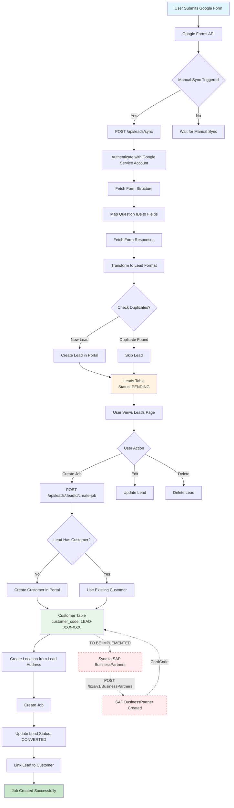

# Leads Flow: Google Form → Portal → SAP

## Current Flow Diagram



## Data Transformation Points

### Point 1: Google Form → Portal Leads

**Location:** `pages/api/leads/sync.js`

**Transformation:**
```
Google Form Response
  ↓
Question ID Mapping (lines 316-356)
  ↓
Field Extraction (lines 504-570)
  ↓
Lead Data Object (lines 164-191)
  ↓
Portal leads Table
```

**Key Fields Mapped:**
- `email` ← Google Form "Email" question
- `full_name` ← Google Form "Full Name" question
- `handphone` ← Google Form "Handphone/Phone" question
- `block` ← Google Form "Block" question
- `unit` ← Google Form "Unit" question
- `address` ← Google Form "Address/Location" question
- `first_service_date` ← Google Form "First Service Date" question
- `google_form_response_id` ← Google Forms API `responseId`

### Point 2: Portal Lead → Portal Customer

**Location:** `pages/api/leads/[leadId]/create-job.js`

**Transformation:**
```
Portal Lead
  ↓
Customer Creation (lines 58-102)
  ↓
Portal customer Table
```

**Key Fields Mapped:**
- `customer_code` ← Auto-generated: `LEAD-{EMAIL_PREFIX}-{TIMESTAMP}`
- `customer_name` ← `lead.full_name`
- `email` ← `lead.email`
- `phone_number` ← `lead.handphone`

### Point 3: Portal Customer → SAP BusinessPartner

**Location:** ⚠️ **NOT YET IMPLEMENTED**

**Required Transformation:**
```
Portal Customer + Lead
  ↓
SAP BusinessPartner Format
  ↓
POST /b1s/v1/BusinessPartners
  ↓
SAP BusinessPartner Created
```

**Key Fields to Map:**
- `CardCode` ← `customer.customer_code`
- `CardName` ← `customer.customer_name`
- `EmailAddress` ← `customer.email`
- `Phone1` ← `customer.phone_number`
- `BPAddresses[]` ← `lead.block`, `lead.unit`, `lead.address`
- `ContactEmployees[]` ← `lead.full_name`, `lead.handphone`, `lead.email`

## Current System State

### ✅ Implemented

1. **Google Form Integration**
   - Service Account authentication
   - Form structure fetching
   - Response fetching
   - Question ID to field mapping
   - Duplicate detection

2. **Portal Lead Management**
   - Lead creation from Google Forms
   - Lead listing and filtering
   - Lead editing
   - Lead deletion
   - Lead status tracking

3. **Lead to Customer Conversion**
   - Customer creation from lead
   - Location creation from lead address
   - Job creation from lead
   - Lead status update to CONVERTED

### ❌ Missing (To Be Implemented)

1. **SAP BusinessPartner Creation**
   - No API endpoint to create BusinessPartner in SAP
   - No sync when customer is created in Portal
   - No mapping from Portal customer to SAP format

2. **SAP Sync Service**
   - No method in `sapService.js` to create BusinessPartner
   - No error handling for SAP sync failures
   - No retry mechanism

3. **Data Consistency**
   - No validation that Portal `customer_code` matches SAP `CardCode`
   - No sync status tracking
   - No conflict resolution

## Next Steps

1. **Create SAP BusinessPartner Creation Method**
   - Add `createBusinessPartner()` to `lib/services/sapService.js`

2. **Create SAP Sync API Endpoint**
   - Create `pages/api/customers/sync-to-sap.js`
   - Handle customer → SAP transformation
   - Handle errors gracefully

3. **Integrate SAP Sync into Customer Creation**
   - Update `pages/api/leads/[leadId]/create-job.js`
   - Call SAP sync after customer creation
   - Log sync status

4. **Add Sync Status Tracking**
   - Add fields to `customer` table:
     - `sap_synced_at` (TIMESTAMP)
     - `sap_sync_error` (TEXT)
     - `sap_card_code` (VARCHAR) - Store SAP CardCode

5. **Create Data Mapping Configuration**
   - Create config file for field mappings
   - Make mappings configurable
   - Support custom field mappings

